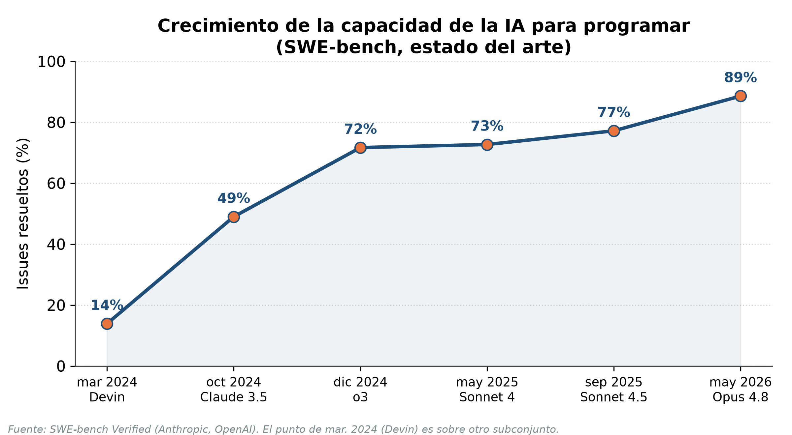
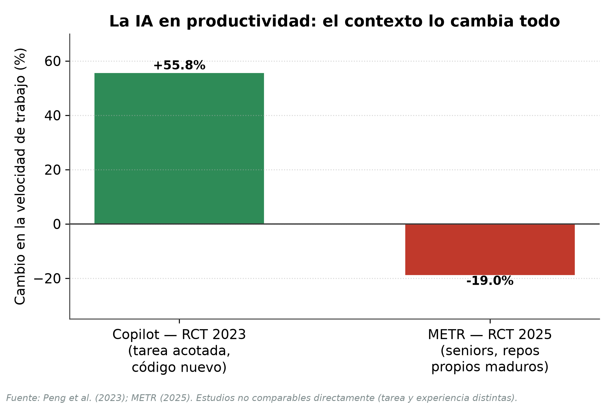
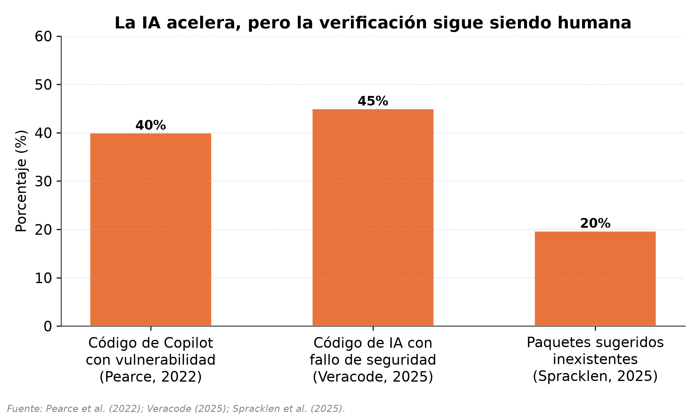
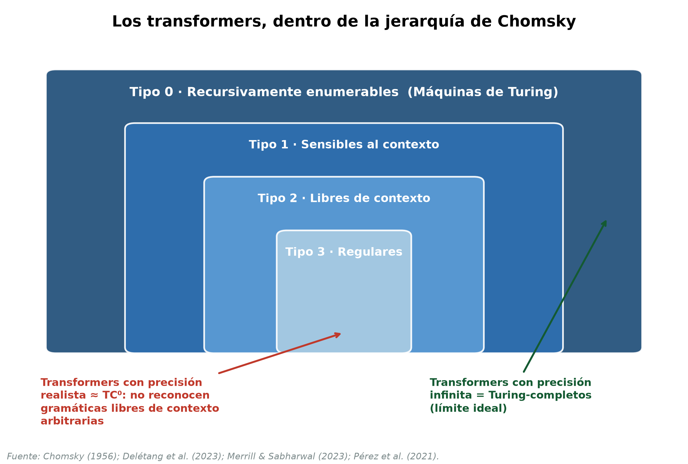
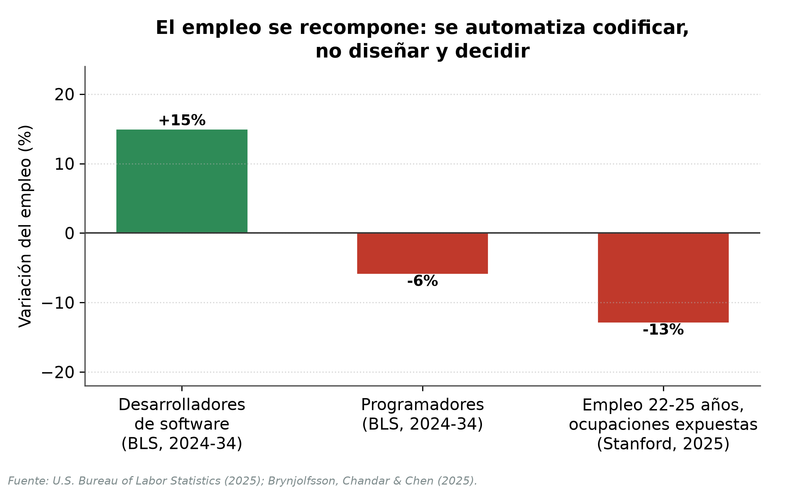
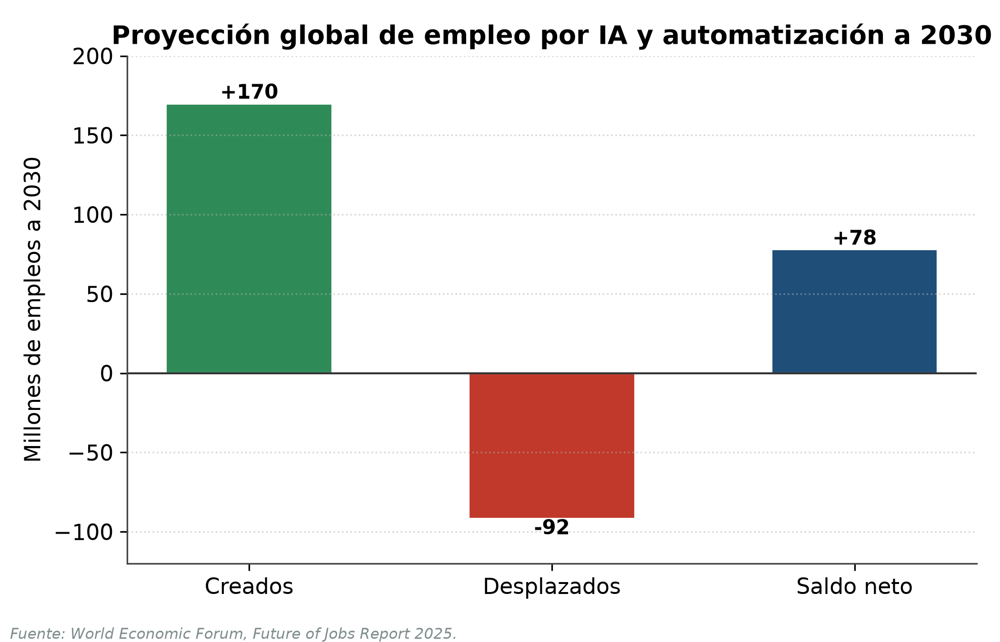

# El rol del ingeniero informático en los próximos diez años: de la ejecución técnica a la supervisión crítica de sistemas automatizados

## Resumen

La irrupción de la inteligencia artificial generativa y de los agentes de programación autónomos ha reabierto una pregunta tan vieja como la propia disciplina: ¿seguirá existiendo el ingeniero informático? Este trabajo sostiene que, en la próxima década, el ingeniero no será reemplazado por la tecnología, sino que su rol se transformará: dejará de centrarse en la ejecución técnica para enfocarse en la especificación, la integración, la validación y la supervisión crítica de sistemas automatizados. El argumento se construye sobre tres pilares: la evidencia histórica de que cada salto de abstracción elevó el nivel del trabajo en lugar de eliminarlo; la evidencia empírica reciente (2021-2026) sobre el alcance y los límites medidos de la IA en el desarrollo de software; y, como columna vertebral teórica, los límites fundamentales de la computación —el problema de la detención, el teorema de Rice, la cuestión P vs. NP y la jerarquía de Chomsky— que garantizan la existencia de un núcleo irreductiblemente humano de juicio. La conclusión es una proyección calibrada: el ingeniero del futuro ascenderá en la escalera de abstracción hacia tareas que la teoría de la computación demuestra que ninguna máquina puede automatizar por completo.

**Palabras clave:** ingeniería de software, inteligencia artificial, indecidibilidad, problema de la detención, P vs. NP, jerarquía de Chomsky, automatización.

## I. Introducción

Cada vez que la tecnología avanzó de forma significativa, el rol del ingeniero informático cambió con ella. Los lenguajes de alto nivel, los entornos integrados de desarrollo o la computación en la nube modificaron profundamente su trabajo diario; sin embargo, ninguna de esas revoluciones hizo desaparecer la profesión. Hoy, la inteligencia artificial generativa —y en particular los modelos grandes de lenguaje (LLM) y los agentes de codificación autónomos— plantean el desafío más radical hasta la fecha, al punto de que destacados referentes de la industria pronostican que la mayor parte del código será escrita por máquinas en pocos años.

Este trabajo parte de la siguiente hipótesis: en los próximos diez años, el rol del ingeniero informático dejará de centrarse en la ejecución técnica para abarcar la toma de decisiones, la integración de tecnologías y la supervisión crítica de sistemas automatizados. El ingeniero no será reemplazado, sino que se volverá menos operativo y más estratégico, con mayor responsabilidad en diseñar, validar y controlar sistemas complejos.

Metodológicamente es un ensayo argumentativo basado en una revisión de fuentes técnicas, empíricas y teóricas. Para sostenerla se recorre la historia de la profesión como sucesión de abstracciones (II), el estado actual de la IA en el desarrollo de software (III) y el marco teórico de la materia —los límites computacionales que explican *por qué* persiste un rol humano (IV)—, para luego caracterizar el nuevo rol, las visiones de expertos y las limitaciones (V a VII). Por ser una proyección a futuro, la conclusión es una estimación fundada.

## II. La escalera de abstracción: una historia de transformaciones, no de extinciones

La historia del software puede leerse como el ascenso por una «escalera de abstracción» en la que cada peldaño automatizó el trabajo del peldaño anterior y, lejos de suprimir al ingeniero, lo elevó a un nivel conceptual superior. En los años cuarenta y cincuenta, programar significaba escribir código máquina y, más tarde, lenguaje ensamblador; el propio ensamblador fue la primera herramienta que automatizó la traducción de mnemónicos a instrucciones binarias. El salto decisivo llegó con los lenguajes de alto nivel: FORTRAN, diseñado por John Backus en IBM y distribuido desde 1957, permitió expresar algoritmos en notación matemática y delegó en un compilador la generación del código de bajo nivel; COBOL, inspirado en el trabajo de Grace Hopper, hizo lo propio para el ámbito de los negocios.

Paradójicamente, esta creciente potencia trajo aparejada una crisis. En la célebre Conferencia de Ingeniería de Software de la OTAN, celebrada en Garmisch en octubre de 1968, los asistentes acuñaron la expresión «crisis del software» para describir la incapacidad de los programadores de gestionar la complejidad de sistemas cada vez más grandes (Naur y Randell, 1969). Como sintetizaría Edsger Dijkstra en su conferencia Turing de 1972, «mientras no había máquinas, programar no era ningún problema; (…) ahora que tenemos computadoras gigantescas, programar se ha convertido en un problema igualmente gigantesco» (Dijkstra, 1972). La respuesta a esa crisis no fue menos ingeniería, sino más: nacieron la programación estructurada, las metodologías y la disciplina misma de la ingeniería de software.

Los peldaños siguientes confirman el patrón. Los entornos integrados de desarrollo comprimieron el ciclo de edición, compilación y prueba; el software libre, Git (2005) y Stack Overflow (2008) compartieron el conocimiento; la nube (Amazon Web Services, 2006) abstrajo la infraestructura física y la cultura DevOps (2009) automatizó el despliegue. En 2021, GitHub Copilot introdujo el primer «programador en par» basado en IA. En todos los casos la herramienta automatizó lo más rutinario, pero el ingeniero permaneció: ascendió de la gestión de registros al diseño de arquitecturas distribuidas. La IA generativa es el peldaño más alto de una escalera muy larga. Y el anuncio de la desaparición del programador no es nuevo: ya se proclamó con COBOL, con los lenguajes de cuarta generación y con las plataformas «sin código», y cada vez la profesión creció; la tesis del «fin de la programación» (Welsh, 2023) es la más reciente de una larga serie de profecías incumplidas.

## III. El presente: la IA agéntica en el desarrollo de software (2021-2026)

El ritmo del cambio reciente es difícil de exagerar. En el *benchmark* SWE-bench Verified, que mide la capacidad de los sistemas de IA para resolver *issues* reales de proyectos de software, el estado del arte pasó de resolver alrededor del 14 % de los problemas a comienzos de 2024 a cerca del 77 % en 2025 (Anthropic, 2025): de uno de cada siete casos a más de tres de cada cuatro en unos dieciocho meses. La adopción acompaña esa capacidad: GitHub Copilot superó los veinte millones de usuarios en 2025; Sundar Pichai afirmó en 2024 que la IA genera —y los ingenieros luego revisan— «más de una cuarta parte de todo el código nuevo en Google» y Satya Nadella la estimó en 2025 entre el 20 % y el 30 % en Microsoft (Zeff, 2025).

Ahora bien, la evidencia rigurosa sobre su impacto es más matizada de lo que sugiere el entusiasmo. Un experimento controlado de GitHub y Microsoft mostró que los desarrolladores que usaban Copilot completaban una tarea acotada —programar un servidor HTTP— un 55,8 % más rápido (Peng et al., 2023), y McKinsey estimó mejoras de productividad de entre el 20 % y el 45 % en la función de ingeniería de software (McKinsey & Company, 2023). Sin embargo, un ensayo controlado aleatorizado independiente de METR (2025) arrojó un resultado contraintuitivo: desarrolladores *experimentados* en sus propios repositorios maduros tardaron un 19 % *más* con herramientas de IA, pese a que *creían* haberse acelerado un 20 %. La brecha entre la productividad percibida y la real es, en sí misma, un dato relevante.

A esta tensión se suman los problemas de calidad y seguridad. Addy Osmani, ingeniero de Google, describió el «problema del 70 %»: la IA produce con rapidez el 70 % de una solución, pero el 30 % final —casos límite, depuración, integración con producción, mantenibilidad— sigue requiriendo el juicio de un ingeniero experimentado (Osmani, 2024). Un estudio controlado de la Universidad de Stanford halló que los programadores con acceso a un asistente de IA escribían código *menos* seguro y confiaban *más* en su seguridad: una peligrosa falsa sensación de confianza (Perry et al., 2023). Las evaluaciones de corrección apuntan en el mismo sentido: al endurecer los conjuntos de prueba, la corrección medida del código generado cae entre 19 y 29 puntos (Liu et al., 2023), y cerca del 40 % de las sugerencias de Copilot en escenarios de seguridad incluyen vulnerabilidades conocidas (Pearce et al., 2022). La IA, en suma, acelera la producción pero no garantiza la corrección: traslada el cuello de botella desde la escritura del código hacia su verificación.

## IV. El marco teórico: los límites computacionales que protegen el rol del ingeniero

¿Por qué, pese a estos avances, es razonable sostener que el ingeniero no desaparecerá? La respuesta más profunda no proviene de la economía ni de la sociología, sino de la propia teoría de la computación. Existen barreras matemáticas, demostradas y permanentes, que ninguna IA —que es, en última instancia, un proceso computable— puede sortear.

La primera es la **indecidibilidad**. En 1936, Alan Turing demostró que el problema de la detención (*halting problem*) es indecidible: no existe ningún algoritmo que, dado un programa y una entrada arbitrarios, determine en todos los casos si ese programa terminará o se ejecutará indefinidamente (Turing, 1936). El teorema de Rice (1953) generaliza este resultado: *toda* propiedad semántica no trivial de los programas —toda afirmación sobre el comportamiento de un programa, como «¿produce siempre la salida correcta?» o «¿cumple esta especificación?»— es indecidible (Rice, 1953). La implicación es directa: ningún procedimiento general y automático decide si un programa arbitrario satisface su especificación —tampoco un humano en el caso general—. El límite no vuelve al ingeniero un verificador infalible, sino el responsable de un juicio falible sobre instancias acotadas, que solo se resuelve restringiendo el problema o renunciando a la completitud.

La segunda barrera es la **intratabilidad**. El problema P vs. NP, uno de los siete Problemas del Milenio, pregunta si todo problema cuya solución puede verificarse rápidamente puede también resolverse rápidamente (Cook, 1971; Karp, 1972). Bajo la hipótesis ampliamente aceptada de que P ≠ NP, numerosos problemas centrales de la ingeniería (planificación, ruteo, asignación de recursos) son NP-difíciles y no admiten soluciones eficientes en el peor caso. Este límite es matemático, no de capacidad de cómputo: ninguna IA lo derogará. El ingeniero seguirá siendo quien elija heurísticas, aproximaciones y compromisos; decidir *qué* sacrificar —optimalidad, tiempo o recursos— es un acto de juicio, no un cálculo automatizable.

La tercera barrera concierne al lenguaje. La jerarquía de Chomsky (1956) organiza los lenguajes formales según su poder generativo, y la sintaxis de los lenguajes de programación es esencialmente libre de contexto —su léxico es regular y ciertas reglas (tipos, declaración previa al uso) son sensibles al contexto (Aho et al., 2007)—: son formales y se diseñan para analizarse de manera determinista y sin ambigüedad. El lenguaje natural —y, con él, las instrucciones que un humano da a un LLM— es, en cambio, ambiguo, dependiente del contexto y no constituye un lenguaje formal. El rol perdurable del ingeniero es justamente el de traductor entre ambos mundos: convertir la intención humana, informal e incompleta, en una especificación formal que una máquina pueda ejecutar. Esta conexión no es una mera analogía: trabajos recientes muestran que el cómputo interno de un *transformer* con precisión logarítmica está acotado por la clase TC⁰ y —salvo que se derrumben conjeturas de complejidad ampliamente aceptadas— no reconoce gramáticas libres de contexto arbitrarias (Delétang et al., 2023; Merrill y Sabharwal, 2023); la arquitectura actual no generaliza a lenguajes que exceden ese nivel. La teoría de lenguajes formales y la complejidad describen, así, los límites concretos de la IA que el ingeniero debe conocer.

Estas barreras alcanzan también a la propia IA. Trabajos recientes demuestran, mediante diagonalización apoyada en la indecidibilidad del problema de la detención, que la «alucinación» es una limitación innata de los LLM: ningún modelo puede aprender todas las funciones computables, por lo que producirá inevitablemente errores que no puede detectar por sí mismo (Xu et al., 2024). Un LLM no puede autoverificar su salida; necesita un agente externo —el ingeniero— que la contraste con la realidad y asuma la responsabilidad.

Finalmente, Brooks (1987) distinguió la complejidad **accidental** —la del proceso de construcción, que las herramientas sí reducen— de la **esencial** —la dificultad conceptual inherente al problema—. Para Brooks, «la parte más difícil de construir un sistema de software es decidir con precisión qué construir»: la IA ataca lo accidental, pero decidir qué construir, para quién y con qué compromisos éticos es un acto humano cargado de valores, no un cómputo. En la misma línea, Naur (1985) sostuvo que el verdadero producto de programar es una *teoría* del problema que reside en la mente del equipo y que ninguna especificación formal captura. Allí reside el corazón irreductible de la ingeniería.

## V. El nuevo rol: del ejecutor al supervisor crítico

Si la teoría garantiza un núcleo humano, la economía explica por qué ese núcleo no solo persistirá, sino que probablemente se ampliará. La historia de la automatización lo ilustra con la «paradoja de Jevons»: cuando una tecnología abarata el uso de un recurso, su consumo total tiende a aumentar. El caso de los cajeros automáticos es ilustrativo: al abaratar la sucursal, los bancos abrieron más y el empleo de cajeros creció durante dos décadas —antes de revertirse con la banca móvil—, aunque la tarea viró hacia la atención (Bessen, 2015). Aplicada al software, la lógica es análoga: al volverse más barato producir, la demanda —y la de quienes lo diseñan y controlan— podría crecer (Acemoglu y Restrepo, 2019; Autor, 2015). Thomas Dohmke, entonces director ejecutivo de GitHub, llegó a proyectar «mil millones de desarrolladores habilitados por miles de millones de agentes de IA» (Dohmke, 2025).

El nuevo rol puede describirse como un peldaño más en la escalera de abstracción. El ingeniero del futuro escribirá menos código línea por línea y, en cambio, dedicará su tiempo a: **especificar** con precisión qué debe hacer el sistema (la complejidad esencial de Brooks); **diseñar** arquitecturas e integrar componentes heterogéneos, incluidos los propios modelos de IA; **validar** el código generado —algo que Rice y Turing vuelven indecidible en general y, por eso, no delegable—; **supervisar críticamente** sistemas autónomos que ni siquiera pueden autoverificarse, atendiendo a su seguridad y su sesgo; y **decidir**, bajo la intratabilidad de P vs. NP, qué sacrificar y con qué valores. Es, precisamente, el «30 % difícil» de Osmani convertido en el centro de gravedad de la profesión. Las proyecciones de competencias confirman ese desplazamiento: cerca del 40 % de las habilidades cambiarán hacia 2030, con el pensamiento analítico, la IA y los datos, y la ciberseguridad entre las más demandadas (World Economic Forum, 2025); y marcos como el SWEBOK (Washizaki, 2024) ya definen la ingeniería de software muy por encima de la codificación, abarcando requisitos, arquitectura, validación y seguridad.

Con todo, los datos del mercado laboral advierten que la transición no será indolora ni uniforme. La Oficina de Estadísticas Laborales de EE. UU. proyecta un crecimiento del empleo de «desarrolladores de software» cercano al 15 % entre 2024 y 2034 —muy por encima del promedio—, mientras la categoría más estrecha de «programadores» se contraería un 6 % por la automatización (Bureau of Labor Statistics, 2025): se automatiza la tarea de codificar, no la de diseñar y decidir. A la vez, un estudio de Stanford halló una caída de empleo del 13 % al 16 % en los trabajadores de carrera temprana (22-25 años) de las ocupaciones más expuestas a la IA —entre ellas el desarrollo de software—, mientras los de mayor experiencia se mantenían estables (Brynjolfsson et al., 2025). La «puerta de entrada» junior se estrecha y la demanda se desplaza hacia perfiles con criterio: las competencias del nuevo rol.

## VI. Visiones de los expertos: optimismo, cautela y un consenso implícito

Como toda proyección, depende de cómo lean el futuro quienes lo construyen, y sus opiniones, aunque dispares, convergen en un punto. En el extremo más audaz, Dario Amodei (Anthropic) pronosticó en marzo de 2025 que la IA escribiría el 90 % del código en tres a seis meses y «esencialmente todo» en doce; pero aclaró de inmediato que «el programador todavía debe especificar (…) las decisiones generales de diseño» (Council on Foreign Relations, 2025). Andrej Karpathy describió el «Software 3.0», en el que «programamos las computadoras en inglés» (Karpathy, 2025), y popularizó el *vibe coding* para la programación guiada por la intuición y delegada en la IA.

No todas las voces comparten ese optimismo. Grady Booch, coautor de UML, replicó a Amodei que tales pronósticos revelan «una incomprensión fundamental de lo que es la ingeniería de software» y condensó la cuestión en una frase: «tus herramientas están cambiando, pero tus problemas no» (Booch, 2026). Bjarne Stroustrup, creador de C++, advirtió por su parte que el riesgo no es tanto el reemplazo como que los programadores «pierdan la capacidad de detectar problemas por estar tan acostumbrados a que se los resuelvan» (Stroustrup, 2025), un peligro que la sección anterior fundamenta teóricamente.

Sam Altman, de OpenAI, ofrece quizás la síntesis más equilibrada. Ante la pregunta de si conviene seguir contratando ingenieros respondió que «cada ingeniero de software hará, durante un buen tiempo, muchísimo más» (Thompson, 2025), y agregó que «mucha más gente podrá crear software, pero los expertos seguirán siendo mucho mejores que los novatos, si adoptan las nuevas herramientas» (Altman, 2025). Es la hipótesis de este trabajo en boca de un protagonista del cambio: la IA no anula al ingeniero, sino que amplifica al que sabe usarla. Existen, es cierto, posiciones más radicales —Welsh anuncia software «entrenado, no programado»—, pero incluso varias de las voces más optimistas reservan para el humano las tareas de especificar, decidir y juzgar: las mismas que la teoría de la computación demuestra que no pueden automatizarse.

## VII. Limitaciones del análisis

Este trabajo proyecta una tendencia a diez años, y toda predicción tecnológica es muy incierta; la conclusión es, por tanto, una estimación fundada y no una certeza. Buena parte de la evidencia cuantitativa proviene de estudios recientes, algunos aún en forma de *working papers* no revisados por pares, y de declaraciones de ejecutivos con intereses comerciales en la propia tecnología que promueven, lo que obliga a leerlas con cautela. La causalidad de los fenómenos laborales observados es, además, materia de debate: la contracción del empleo junior podría obedecer tanto a la IA como al fin del crédito barato y a la sobrecontratación previa. Cabe una objeción al propio marco teórico: la indecidibilidad y la intratabilidad rigen el caso general, mientras la ingeniería opera a menudo sobre instancias restringidas donde la automatización sí es muy eficaz; el límite acota la automatización *total*, no los avances parciales. Aun así, los resultados de Turing, Rice, Cook y Chomsky no caducan con la próxima versión de un modelo y son el fundamento más firme de la tesis aquí defendida.

## VIII. Conclusión

El recorrido permite confirmar, con matices, la hipótesis inicial. En los próximos diez años el ingeniero informático conservará su lugar, pero no su forma de trabajo: el centro de gravedad de la profesión pasará de la ejecución técnica —escribir código línea por línea— a la especificación, el diseño, la integración y, sobre todo, la validación y supervisión crítica de sistemas crecientemente autónomos. La historia respalda esta lectura: cada abstracción anterior elevó al ingeniero en lugar de eliminarlo; la evidencia empírica reciente la matiza, al mostrar que la IA acelera la producción pero degrada la garantía de corrección; y la teoría de la computación la fundamenta, al demostrar que la verificación universal (Rice y Turing), la resolución eficiente de todo problema (P vs. NP) y la traducción de la intención ambigua al lenguaje formal (Chomsky) no son tareas que una máquina pueda asumir por completo.

La paradoja final es esperanzadora: cuanto más poderosa se vuelve la automatización, más valioso se torna el juicio humano que decide qué automatizar, cómo validarlo y para qué fin. El ingeniero del futuro será menos un escriba de instrucciones y más un arquitecto, un auditor y un responsable último de sistemas que ni él ni la máquina pueden comprender por completo. La teoría de la computación, lejos de anunciar el fin de la profesión, traza el contorno preciso de su porvenir.

## Bibliografía

Acemoglu, D., & Restrepo, P. (2019). Automation and new tasks: How technology displaces and reinstates labor. *Journal of Economic Perspectives, 33*(2), 3-30. https://doi.org/10.1257/jep.33.2.3

Aho, A. V., Lam, M. S., Sethi, R., & Ullman, J. D. (2007). *Compilers: Principles, techniques, and tools* (2.ª ed.). Pearson Addison-Wesley.

Altman, S. (2025, 10 de junio). *The gentle singularity*. https://blog.samaltman.com/the-gentle-singularity

Anthropic. (2025, 22 de mayo). *Introducing Claude 4*. https://www.anthropic.com/news/claude-4

Autor, D. H. (2015). Why are there still so many jobs? The history and future of workplace automation. *Journal of Economic Perspectives, 29*(3), 3-30. https://doi.org/10.1257/jep.29.3.3

Bessen, J. (2015). Toil and technology. *Finance & Development, 52*(1), 16-19. International Monetary Fund. https://www.imf.org/external/pubs/ft/fandd/2015/03/bessen.htm

Booch, G. (2026, 4 de febrero). *The third golden age of software engineering — Thanks to AI, with Grady Booch* [Episodio de pódcast]. The Pragmatic Engineer (G. Orosz, entrevistador). https://newsletter.pragmaticengineer.com/p/the-third-golden-age-of-software

Brooks, F. P. (1987). No silver bullet: Essence and accidents of software engineering. *Computer, 20*(4), 10-19. https://doi.org/10.1109/MC.1987.1663532

Brynjolfsson, E., Chandar, B., & Chen, R. (2025). *Canaries in the coal mine? Six facts about the recent employment effects of artificial intelligence*. Stanford Digital Economy Lab. https://digitaleconomy.stanford.edu/publications/canaries-in-the-coal-mine/

Bureau of Labor Statistics. (2025). *Software developers, quality assurance analysts, and testers*. Occupational Outlook Handbook. U.S. Department of Labor. https://www.bls.gov/ooh/computer-and-information-technology/software-developers.htm

Chomsky, N. (1956). Three models for the description of language. *IRE Transactions on Information Theory, 2*(3), 113-124. https://doi.org/10.1109/TIT.1956.1056813

Cook, S. A. (1971). The complexity of theorem-proving procedures. En *Proceedings of the Third Annual ACM Symposium on Theory of Computing (STOC '71)* (pp. 151-158). Association for Computing Machinery. https://doi.org/10.1145/800157.805047

Council on Foreign Relations. (2025, 10 de marzo). *CEO speaker series with Dario Amodei of Anthropic* [Transcripción del evento]. https://www.cfr.org/event/ceo-speaker-series-dario-amodei-anthropic

Delétang, G., Ruoss, A., Grau-Moya, J., Genewein, T., Wenliang, L. K., Catt, E., Cundy, C., Hutter, M., Legg, S., Veness, J., & Ortega, P. A. (2023). *Neural networks and the Chomsky hierarchy* [Ponencia]. International Conference on Learning Representations (ICLR 2023). https://doi.org/10.48550/arXiv.2207.02098

Dijkstra, E. W. (1972). The humble programmer. *Communications of the ACM, 15*(10), 859-866. https://doi.org/10.1145/355604.361591

Dohmke, T. (2025, 11 de agosto). *Auf Wiedersehen, GitHub*. The GitHub Blog. https://github.blog/news-insights/company-news/goodbye-github/

Karp, R. M. (1972). Reducibility among combinatorial problems. En *Complexity of computer computations* (pp. 85-103). Plenum Press. https://doi.org/10.1007/978-1-4684-2001-2_9

Karpathy, A. (2025, 17 de junio). *Software is changing (again)* [Video]. Y Combinator AI Startup School. YouTube. https://www.youtube.com/watch?v=LCEmiRjPEtQ

Liu, J., Xia, C. S., Wang, Y., & Zhang, L. (2023). Is your code generated by ChatGPT really correct? Rigorous evaluation of large language models for code generation. En *Advances in Neural Information Processing Systems 36 (NeurIPS 2023)* (pp. 21558-21572). https://doi.org/10.48550/arXiv.2305.01210

McKinsey & Company. (2023, 27 de junio). *Unleashing developer productivity with generative AI*. https://www.mckinsey.com/capabilities/mckinsey-digital/our-insights/unleashing-developer-productivity-with-generative-ai

Merrill, W., & Sabharwal, A. (2023). The parallelism tradeoff: Limitations of log-precision transformers. *Transactions of the Association for Computational Linguistics, 11*, 531-545. https://doi.org/10.1162/tacl_a_00562

METR. (2025, 10 de julio). *Measuring the impact of early-2025 AI on experienced open-source developer productivity*. https://metr.org/blog/2025-07-10-early-2025-ai-experienced-os-dev-study/

Naur, P. (1985). Programming as theory building. *Microprocessing and Microprogramming, 15*(5), 253-261. https://doi.org/10.1016/0165-6074(85)90032-8

Naur, P., & Randell, B. (Eds.). (1969). *Software engineering: Report on a conference sponsored by the NATO Science Committee, Garmisch, Germany, 7th to 11th October 1968*. Scientific Affairs Division, NATO.

Osmani, A. (2024, 4 de diciembre). *The 70% problem: Hard truths about AI-assisted coding*. https://addyo.substack.com/p/the-70-problem-hard-truths-about

Pearce, H., Ahmad, B., Tan, B., Dolan-Gavitt, B., & Karri, R. (2022). Asleep at the keyboard? Assessing the security of GitHub Copilot's code contributions. En *2022 IEEE Symposium on Security and Privacy (SP)* (pp. 754-768). IEEE. https://doi.org/10.1109/SP46214.2022.9833571

Peng, S., Kalliamvakou, E., Cihon, P., & Demirer, M. (2023). *The impact of AI on developer productivity: Evidence from GitHub Copilot* (arXiv:2302.06590). arXiv. https://arxiv.org/abs/2302.06590

Perry, N., Srivastava, M., Kumar, D., & Boneh, D. (2023). Do users write more insecure code with AI assistants? En *Proceedings of the 2023 ACM SIGSAC Conference on Computer and Communications Security (CCS '23)* (pp. 2785-2799). https://doi.org/10.1145/3576915.3623157

Rice, H. G. (1953). Classes of recursively enumerable sets and their decision problems. *Transactions of the American Mathematical Society, 74*(2), 358-366. https://doi.org/10.1090/S0002-9947-1953-0053041-6

Spracklen, J., Wijewickrama, R., Sakib, A. H. M. N., Maiti, A., Viswanath, B., & Jadliwala, M. (2025). We have a package for you! A comprehensive analysis of package hallucinations by code generating LLMs. En *Proceedings of the 34th USENIX Security Symposium*. USENIX Association. https://arxiv.org/abs/2406.10279

Stroustrup, B. (2025, 9 de mayo). *Interview: Bjarne Stroustrup on 21st century C++, AI risks, and why the language is hard to replace* (T. Anderson, entrevistador). DevClass. https://devclass.com/2025/05/09/interview-bjarne-stroustrup-on-21st-century-c-ai-risks-and-why-the-language-is-hard-to-replace/

Thompson, B. (2025, 20 de marzo). *An interview with OpenAI CEO Sam Altman about building a consumer tech company*. Stratechery. https://stratechery.com/2025/an-interview-with-openai-ceo-sam-altman-about-building-a-consumer-tech-company/

Turing, A. M. (1936). On computable numbers, with an application to the Entscheidungsproblem. *Proceedings of the London Mathematical Society, s2-42*(1), 230-265. https://doi.org/10.1112/plms/s2-42.1.230

Veracode. (2025). *GenAI code security report*. https://www.veracode.com/resources/analyst-reports/2025-genai-code-security-report/

Washizaki, H. (Ed.). (2024). *Guide to the Software Engineering Body of Knowledge (SWEBOK Guide), Version 4.0*. IEEE Computer Society. https://www.computer.org/education/bodies-of-knowledge/software-engineering

Welsh, M. (2023). The end of programming. *Communications of the ACM, 66*(1), 34-35. https://doi.org/10.1145/3570220

World Economic Forum. (2025). *The future of jobs report 2025*. https://www.weforum.org/publications/the-future-of-jobs-report-2025/

Xu, Z., Jain, S., & Kankanhalli, M. (2024). *Hallucination is inevitable: An innate limitation of large language models* (arXiv:2401.11817). arXiv. https://arxiv.org/abs/2401.11817

Zeff, M. (2025, 29 de abril). *Microsoft CEO says up to 30% of the company's code was written by AI*. TechCrunch. https://techcrunch.com/2025/04/29/microsoft-ceo-says-up-to-30-of-the-companys-code-was-written-by-ai/
